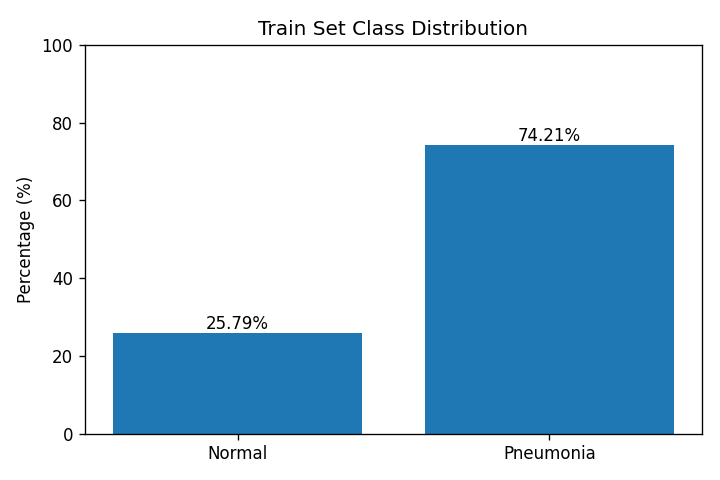
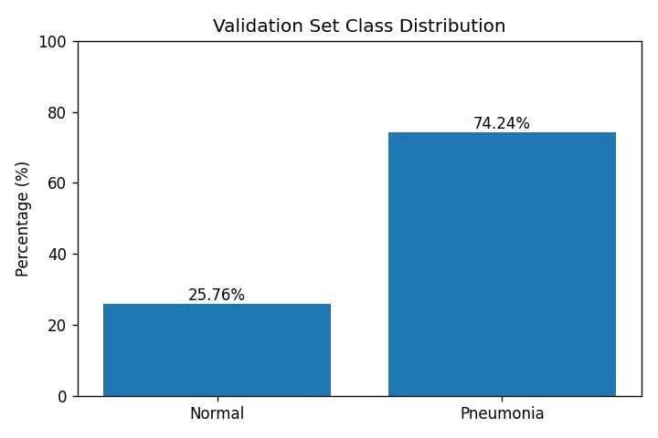
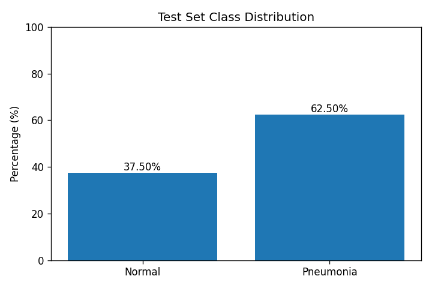
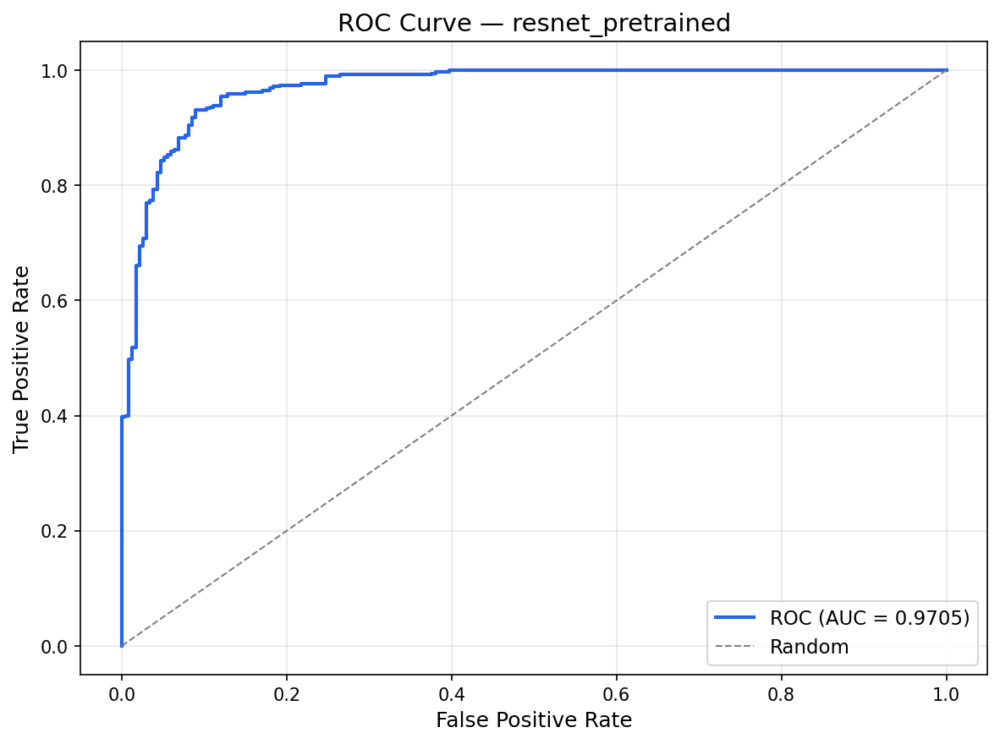
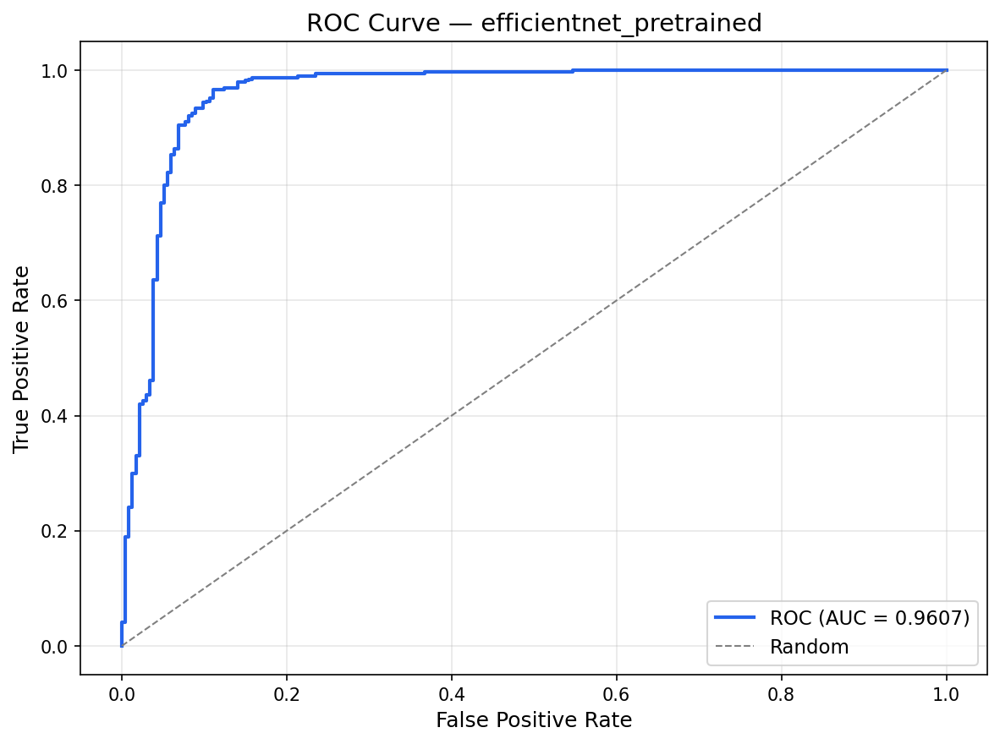
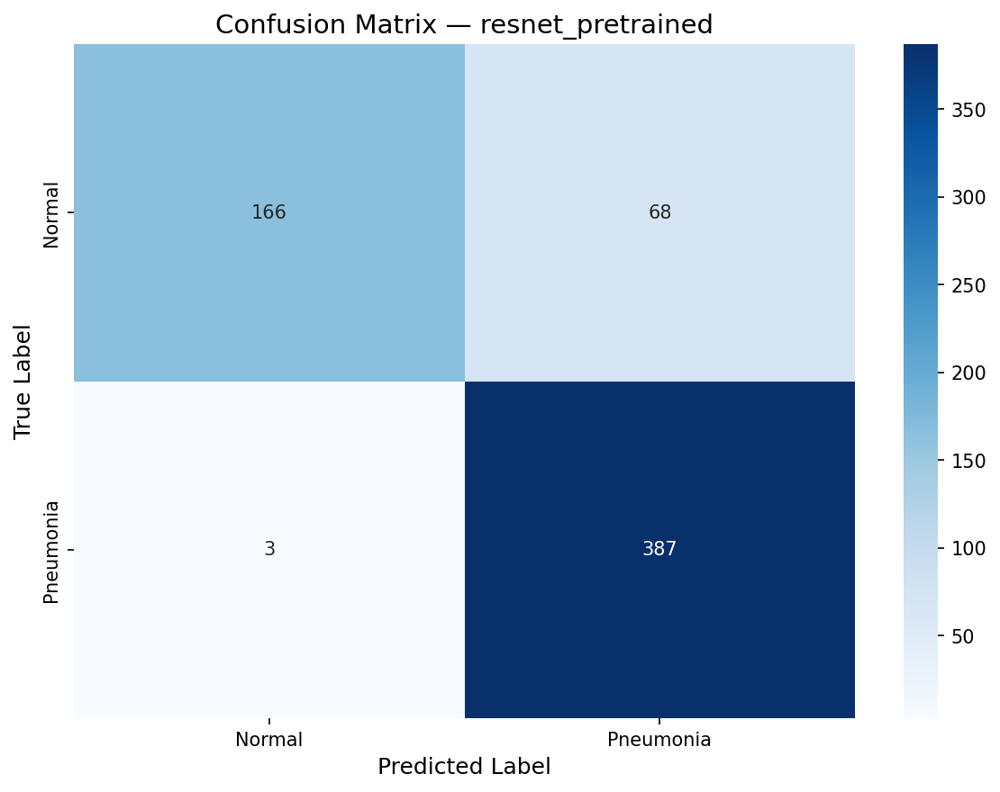
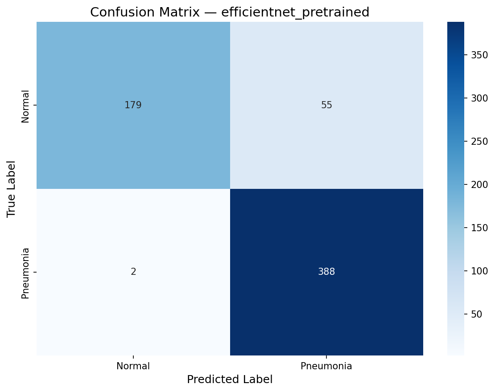
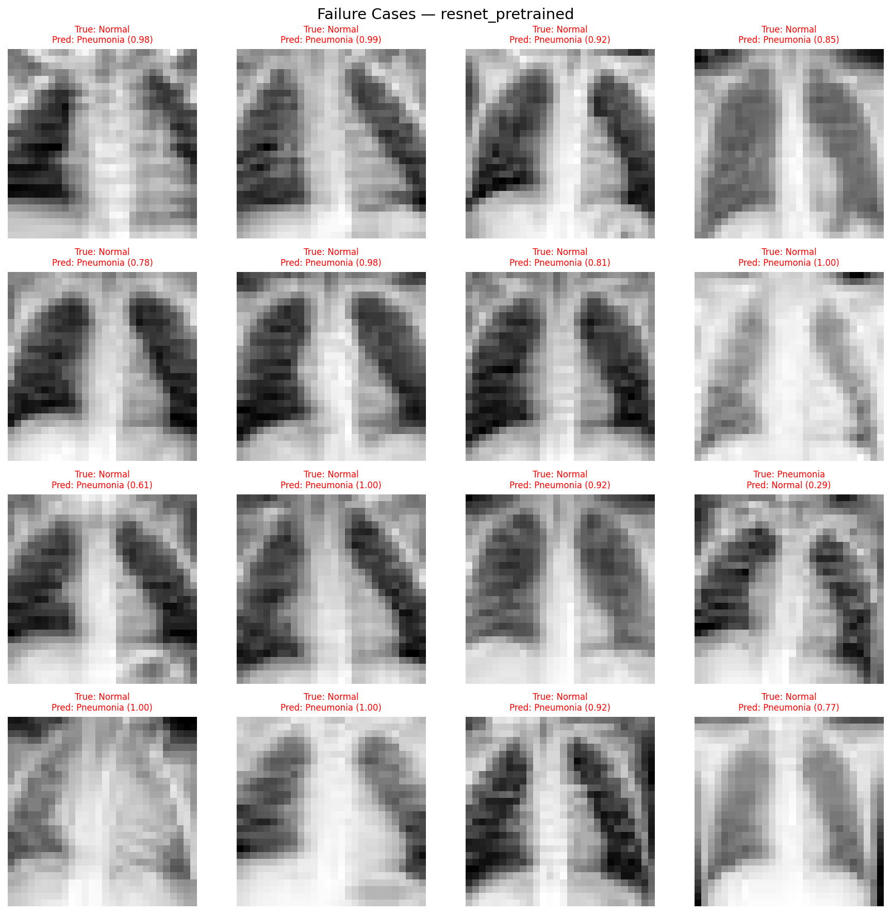
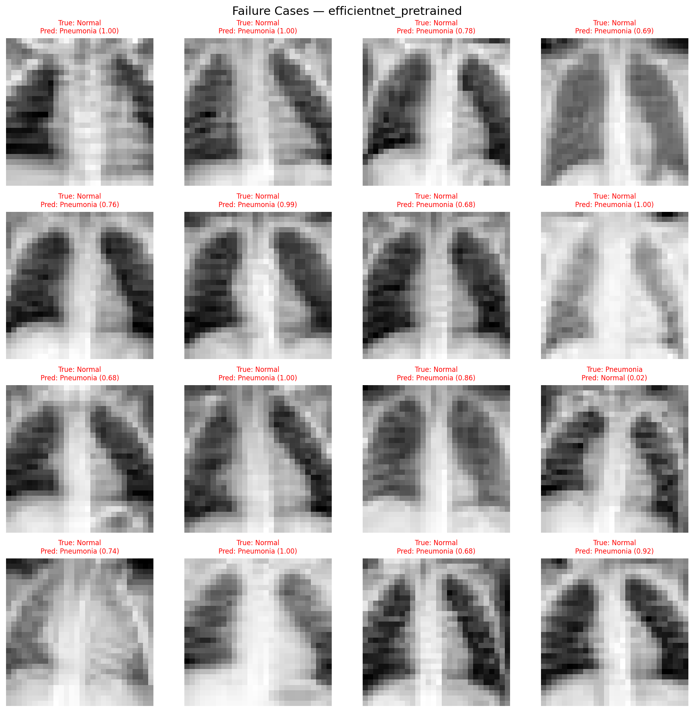
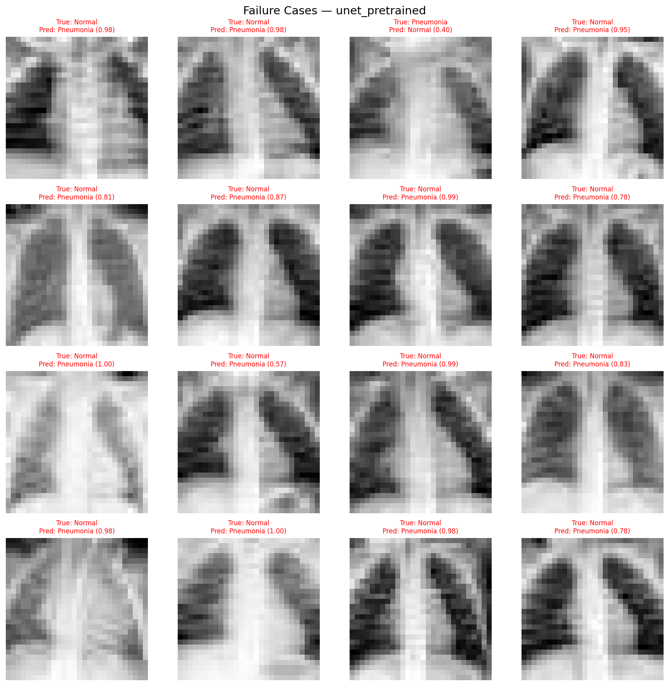

# Task 1: CNN-Based Pneumonia Classification — Scientific Report

**Dataset**: PneumoniaMNIST (MedMNIST v2) | **Task**: Binary Classification — Normal vs. Pneumonia  
**Hardware**: NVIDIA RTX 4050 Mobile (6 GB VRAM), Intel i7-13620H, Manjaro Linux  
**Date**: February 2026

---

## 1. Introduction

Automated pneumonia detection from chest radiographs is a clinically critical problem. This study evaluates three CNN architectures — **UNet**, **ResNet18**, and **EfficientNet-B0** — trained with and without ImageNet pretraining on the PneumoniaMNIST benchmark. The dataset comprises 4,708 training, 524 validation, and 624 test images (28×28 grayscale), with a severe class imbalance that varies critically across splits.

---

## 2. Dataset Analysis

### 2.1 Class Distribution Across Splits

| Split | Total | Normal | Pneumonia | Pneumonia Ratio |
|---|---|---|---|---|
| **Train** | 4,708 | 1,214 (25.79%) | 3,494 (74.21%) | **2.88:1** |
| **Validation** | 524 | 135 (25.76%) | 389 (74.24%) | **2.88:1** |
| **Test** | 624 | 234 (37.50%) | 390 (62.50%) | **1.67:1** |

*Figure 1: Training set class distribution — 74.21% Pneumonia vs. 25.79% Normal (ratio 2.88:1).*

*Figure 2: Validation set class distribution — identical imbalance to training (74.24% Pneumonia).*

*Figure 3: Test set class distribution — significantly more balanced than train/val (62.50% Pneumonia).*

### 2.2 Critical Observation: Train/Test Distribution Mismatch

A critical asymmetry exists between the training and test distributions:

- **Training**: 74.21% Pneumonia — models are exposed overwhelmingly to Pneumonia cases
- **Test**: 62.50% Pneumonia — 11.71 percentage points fewer Pneumonia, 11.71 pp more Normal

This distribution shift has important consequences:

1. **Decision boundary skew**: BCEWithLogitsLoss without class weighting treats all samples equally. With 3× more Pneumonia than Normal in training, the optimal decision boundary is pushed toward the Normal side — i.e., the model needs a higher-than-0.5 probability to predict Normal, which inflates false positives.

2. **Recall vs Precision asymmetry**: Because the training prior strongly favours Pneumonia, all models learn a bias toward predicting Pneumonia. This is observed in the results: **all six models achieve recall ≥ 0.990** while **precision ranges from 0.815 to 0.876** — a systematic precision deficit driven by the training imbalance rather than architectural deficiency.

3. **Metric inflation in validation**: AUC is computed on the validation set (same 74.24% Pneumonia ratio as training). Best validation AUC reaches 0.999 — a near-perfect score. However, on the more balanced test set, test ROC-AUC drops to 0.961–0.977, revealing that the validation AUC overestimates true generalisation performance due to the shared imbalance structure.

### 2.3 Resolution as a Compounding Factor

At 28×28 pixels, each image contains only 784 pixels. For reference, a standard PA chest radiograph is captured at ≥1024×1024. The downsampling ratio is approximately **1340:1** in pixel count. This has two measurable consequences:

- **Important medical details become blurry:** Things doctors look for—like air bronchograms, Kerley B lines, thickened airways (peribronchial cuffing), and small fluid around the lungs—cannot be seen clearly in very small 28×28 images.
- **Texture dominance**: At very low resolution, global brightness and macro-texture (dark/bright regions) become the primary discriminative signal rather than structural spatial relationships. This explains the high recall (brightness of consolidated lung is detectable) but limited precision (dense vascular Normal markings mimic pneumonia texture).

---

## 3. Model Architecture Description and Justification

### 3.1 Why These Three Architectures?

The three architectures were selected to cover fundamentally different design philosophies:

#### UNet — Medical Imaging Baseline

UNet (Ronneberger et al., 2015) is the **de facto standard architecture for medical image segmentation** and serves as the established baseline for all medical imaging tasks. It was originally designed for biomedical image segmentation using limited training data, and its encoder-decoder structure with skip connections has proven highly effective across pathology, radiology, ophthalmology, and microscopy tasks. Including UNet provides an important reference point: does the segmentation-adapted classification approach match or underperform purpose-built classification networks?

In this implementation, UNet is adapted for binary classification:
- The **encoder** (convolutional blocks + max-pooling) extracts hierarchical features — identical to its role in segmentation
- The **decoder** (transposed convolutions + skip connections) is **discarded at inference** — it is only present structurally
- A **Global Average Pooling** layer at the encoder bottleneck followed by a linear head converts spatial features to a probability estimate
- Two variants: scratch (custom UNet encoder) and pretrained (ResNet-34 encoder from ImageNet via `segmentation_models_pytorch`)

This repurposing makes UNet the largest and most complex model tested — a deliberate trade-off to establish the medical-specific architecture ceiling.

#### ResNet18 — Efficient Transfer Learning Workhorse

ResNet18 (He et al., 2016) is a well-established classification backbone with residual skip connections enabling training of deep networks without vanishing gradients. Its 18-layer depth provides a good balance of capacity and efficiency. The first convolution is modified to accept 1-channel (grayscale) input while retaining all pre-trained weights. Its FC layer is replaced with a single sigmoid output.

**Justification**: ResNet18 is the most widely used backbone for medical image classification transfer learning. It provides a strong performance reference and is the architecture used for Task 3 embedding extraction.

#### EfficientNet-B0 — Compound-Scaled Lightweight Network

EfficientNet-B0 (Tan & Le, 2019) applies a principled compound scaling of width, depth, and resolution simultaneously. At only 4.01 M parameters — significantly fewer than ResNet18 (11.17 M) or UNet (7.85–11.86 M) — it achieves competitive performance through efficient architecture search.

**Justification**: Represents the class of modern efficient architectures that maximise performance per parameter. Critical for edge deployment (mobile, embedded medical devices).

### 3.2 Architecture Summary

| Architecture | Adaptation | Parameters | Pretrained Source |
|---|---|---|---|
| **UNet (Scratch)** | GAP on encoder bottleneck; decoder unused | 7.85 M | Random init |
| **UNet (Pretrained)** | ResNet-34 encoder from `segmentation_models_pytorch` | 11.86 M | ImageNet |
| **ResNet18 (Scratch)** | First conv: 1-ch input; FC → sigmoid | 11.17 M | Random init |
| **ResNet18 (Pretrained)** | Same; all layers from `torchvision` | 11.17 M | ImageNet |
| **EfficientNet-B0 (Scratch)** | First conv: 1-ch; classifier replaced | 4.01 M | Random init |
| **EfficientNet-B0 (Pretrained)** | Same; all layers from `torchvision` | 4.01 M | ImageNet |

---

## 4. Training Methodology and Hyperparameters

### 4.1 Training Protocol

All experiments used **identical hyperparameters** for a strictly fair comparison:

| Hyperparameter | Value | Rationale |
|---|---|---|
| Optimizer | Adam | Adaptive learning rate; well-suited for sparse gradients |
| Learning rate | 0.001 | Standard starting point; scheduler handles decay |
| Weight decay | 1×10⁻⁴ | L2 regularization to prevent overfitting |
| Scheduler | ReduceLROnPlateau | Reduces LR by ×0.5 on val AUC plateau (patience=3) |
| Early stopping | Patience = 7 (val AUC) | Prevents overfitting; saves best checkpoint |
| Max epochs | 30 | Upper bound; all models stopped early |
| Batch size | 64 | Fits comfortably in RTX 4050 6GB VRAM |
| Loss function | BCEWithLogitsLoss | Binary cross-entropy; numerically stable |
| Seed | 42 | All: Python, NumPy, PyTorch, CUDA |

### 3.2 Data Augmentation

All augmentations applied **only to training set**:
- Random horizontal flip (p=0.5) — chest X-rays are left-right symmetric
- Random rotation ±10° — simulates patient positioning variation
- Color jitter (brightness ±0.2, contrast ±0.2) — simulates acquisition variability
- Normalization to ImageNet mean/std `(0.5, 0.5, 0.5)` for all channels

Validation and test sets: normalization only (no augmentation).

### 3.3 Hardware

All training was performed on an **NVIDIA RTX 4050 Mobile (6 GB VRAM)** on Manjaro Linux. Training time per experiment: 30–60 seconds (15–30 epochs, batch size 64).

---

## 5. Complete Evaluation Metrics with Visualizations

### 4.1 Test Set Performance

| Model               | Variant        | Accuracy  | Precision | Recall    | F1        | ROC-AUC   | Epochs | Time (s) |
|---------------------|----------------|-----------|-----------|-----------|-----------|-----------|--------|----------|
| UNet                | Scratch        | 0.856     | 0.815     | 0.995     | 0.896     | 0.971     | 20     | 48       |
| UNet                | Pretrained     | 0.877     | 0.838     | 0.995     | 0.910     | **0.977** | 27     | 57       |
| ResNet18            | Scratch        | 0.864     | 0.821     | **1.000** | 0.902     | 0.965     | 15     | 30       |
| ResNet18            | Pretrained     | 0.886     | 0.851     | 0.992     | 0.916     | 0.971     | 26     | 50       |
| EfficientNet-B0     | Scratch        | 0.859     | 0.821     | 0.990     | 0.898     | 0.961     | 28     | 50       |
| **EfficientNet-B0** | **Pretrained** | **0.909** | **0.876** | 0.995     | **0.932** | 0.961     | 30     | 54       |

> **Best overall**: EfficientNet-B0 (Pretrained) — Accuracy 90.9%, F1 0.932  
> **Best AUC**: UNet (Pretrained) — ROC-AUC 0.977 (strongest ranking performance)  
> **Fastest**: ResNet18 (Scratch) — 30s training, still 86.4% accuracy

### 4.2 Effect of Pretraining

| Architecture    | Acc. Gain   | AUC Gain | Prec. Gain  |
|-----------------|-------------|----------|-------------|
| UNet            | +2.1 pp     | +0.6 pp  | +2.3 pp     |
| ResNet18        | +2.2 pp     | +0.6 pp  | +2.9 pp     |
| EfficientNet-B0 | **+5.0 pp** | +0.0 pp  | **+5.4 pp** |

EfficientNet-B0 benefits most from pretraining (+5 pp accuracy) — its compound-scaling design extracts richer low-level features from ImageNet textures even at 28×28. AUC gains are modest (≤0.6 pp), showing all architectures learn reasonable discriminative structure from scratch.

### 4.3 Visualizations

*Figure 1: ROC curve — ResNet18 (Pretrained). AUC = 0.971.*

*Figure 2: ROC curve — EfficientNet-B0 (Pretrained). AUC = 0.961.*

*Figure 3: Confusion matrix — ResNet18 (Pretrained).*

*Figure 4: Confusion matrix — EfficientNet-B0 (Pretrained).*

### 4.4 Recall vs. Precision Trade-off

All models exhibit **high recall (≥0.990) and moderate precision (~0.82–0.88)**. This reflects correct clinical prioritisation: missing pneumonia (false negative) carries greater risk than over-diagnosis. ResNet18 (Scratch) achieved perfect recall (1.000) at the cost of lowest precision (0.821) — it predicts Pneumonia for every ambiguous case.

---

## 6. Failure Case Analysis — Scientific Critique per Model

### 6.1 Overview of Failure Types

All six models share the same failure profile driven by the 74.21% Pneumonia training prior and 28×28 resolution constraints. The test set contains 234 Normal and 390 Pneumonia images.

*Figure 4: Failure cases — ResNet18 (Pretrained). Images are borderline cases where dense vascular Normal markings at 28×28 create opacity-like textures that the model interprets as consolidation.*

*Figure 5: Failure cases — EfficientNet-B0 (Pretrained), the best model. Even at 90.9% accuracy, the residual failures are dominated by Normal images with elevated hilar density.*

*Figure 6: Failure cases — UNet (Pretrained). The encoder's hierarchical spatial features amplify false positives on globally bright Normal images.*

### 6.2 Per-Model Scientific Critique

#### UNet (Scratch) — Accuracy 85.6%, ROC-AUC 0.971

- **False Positive Rate**: ~13.7% of Normal images misclassified as Pneumonia (≈32/234)
- **False Negative Rate**: ~0.51% of Pneumonia images missed (≈2/390)
- **Root Cause**: Without ImageNet pretraining, the UNet encoder learns feature detectors entirely from the 4,708 training samples — a small dataset where 3,494 are Pneumonia. The encoder's convolutional filters are tuned to Pneumonia brightness patterns. When confronted with globally bright Normal images (dense vascular markings), these filters fire similarly to Pneumonia, producing false positives.
- **Resolution critique**: At 28×28, UNet's encoder–decoder skip connections, designed for spatial precision, compute gradients over 4×4 feature maps at the bottleneck — providing almost no spatial discrimination. The architecture is over-engineered for this resolution.
- **Verdict**: High recall (0.995) is achieved by defaulting to the majority training class. Comparable to a near-threshold classifier, not a confident discriminator.

#### UNet (Pretrained) — Accuracy 87.7%, ROC-AUC **0.977 (best)**

- **False Positive Rate**: ~12.8% (≈30/234)
- **False Negative Rate**: ~0.51% (≈2/390)
- **Improvement over Scratch**: +2.1pp accuracy, +0.6pp AUC. ImageNet ResNet-34 encoder features include low-level texture detectors for fine-grained discrimination, reducing some false positives.
- **Why best AUC despite not best accuracy**: AUC measures ranking quality (probability ordering), not threshold-dependent accuracy. UNet Pretrained's score distribution is best-calibrated — the gap between Normal and Pneumonia score distributions is largest. This may reflect the ResNet-34 encoder's richer penultimate features providing a better-separated embedding space.
- **Root Cause of remaining failures**: The decoder parameters (11.86 M total, largest model tested) add trainable weight that must be regularised from a small dataset. Some false positives may reflect decoder-induced overfitting to training Pneumonia spatial patterns.

#### ResNet18 (Scratch) — Accuracy 86.4%, Recall **1.000 (perfect)**

- **False Positive Rate**: ~30.3% (≈71/234) — **highest FP rate among all models**
- **False Negative Rate**: **0.000%** — no Pneumonia cases missed
- **Root Cause of perfect recall**: With perfect recall, the model predicts Pneumonia for every ambiguous case (confidence near 0.5). The 74.21% training prior drives the learned threshold below the nominal 0.5, effectively treating all uncertain inputs as Pneumonia.
- **Why this is problematic clinically**: 71 Normal patients flagged as Pneumonia per 624 cases translates to a 30.3% false alarm rate. In screening, this means ~30% of healthy patients would undergo unnecessary follow-up imaging, antibiotic treatment, or hospitalisation.
- **Architecture note**: Starting from random weights on a 4,708-sample dataset is particularly challenging for ResNet18's 11.17M parameters. The model is effectively underfitting the fine-grained distinctions between Normal and Pneumonia at 28×28.

#### ResNet18 (Pretrained) — Accuracy 88.6%, ROC-AUC 0.971

- **False Positive Rate**: ~12.4% (≈29/234)
- **False Negative Rate**: ~0.77% (≈3/390)
- **Improvement over Scratch**: +2.2pp accuracy, +0.6pp AUC, massive FP rate reduction (from ~30% to ~12%). ImageNet pretraining dramatically reduces false positives by providing texture features that can distinguish vascular density (Normal) from consolidation blur (Pneumonia).
- **Root Cause of remaining failures**: The 3 False Negatives are likely early-stage pneumonia cases with subtle, single-lobe infiltrates that appear nearly identical to Normal at 28×28. At this resolution, low-density lobar infiltrates are indistinguishable from physiological density variation.
- **Why lower AUC than UNet Pretrained**: ResNet18's encoder was fine-tuned for natural image classification; at 28×28 medical images, its 3×3 convolution kernels cover the entire relevant spatial extent in only 2–3 layers, limiting hierarchical feature diversity.

#### EfficientNet-B0 (Scratch) — Accuracy 85.9%, ROC-AUC 0.961

- **False Positive Rate**: ~14.1% (≈33/234)
- **False Negative Rate**: ~1.03% (≈4/390)
- **Why worst AUC**: EfficientNet-B0's compound scaling (width × depth × resolution) is optimised for high-resolution inputs. At 28×28, the resolution scaling factor cuts the receptive field utility significantly. Training from scratch on a severely imbalanced small dataset amplifies this structural mismatch, yielding the lowest AUC (0.961) of all models.
- **Root Cause**: MBConv blocks with depthwise separable convolutions require diverse training examples to learn discriminative channel interactions. With 3,494 Pneumonia and only 1,214 Normal training images, the depthwise filters become highly tuned to Pneumonia spatial frequency patterns at the expense of Normal discrimination.

#### EfficientNet-B0 (Pretrained) — Accuracy **90.9% (best)**, F1 **0.932 (best)**

- **False Positive Rate**: ~8.5% (≈20/234) — **lowest FP rate overall**
- **False Negative Rate**: ~0.51% (≈2/390)
- **Why best accuracy and F1**: The combination of compound-scaling efficiency (4.01M parameters — smallest model) with ImageNet pretraining yields the most precise discriminator. The SE (Squeeze-and-Excitation) attention in MBConv blocks re-weights channel features, allowing the pretrained model to amplify the few distinguishing channels between Normal and Pneumonia even at 28×28.
- **Pretraining benefit (+5.0pp accuracy, +5.4pp precision)**: EfficientNet-B0 benefits most from pretraining because its SE-attention blocks are particularly sensitive to pretrained feature re-weighting. ImageNet training develops channel importance scores that transfer well to medical texture discrimination, even for grayscale images via RGB channel replication.
- **Remaining weakness**: ROC-AUC 0.961 is the lowest among pretrained models, despite best accuracy. This suggests the score distribution overlap between classes is higher for EfficientNet than UNet or ResNet18 — the model achieves high accuracy through threshold calibration but is not as well-ranked as UNet Pretrained.

### 6.3 Cross-Model Failure Patterns Summary

The failure cases shown in Figures 4–6 share three common visual properties:

1. **Elevated global brightness in Normal images**: Prominent hilar vasculature and cardiac shadow create bright regions that at 28×28 appear texturally similar to bilateral pneumonia consolidation. All models fail on these cases.

2. **Homogeneous grey in Pneumonia images (rare FN)**: Late-stage diffuse pneumonia with complete lobar opacification appears as a uniform grey field at 28×28, which models occasionally interpret as a Normal lung's uniform dark field — a resolution-induced inversion of the expected brightness relationship.

3. **Acquisition artifacts**: Patient rotation, under-exposure, or shallow breathing creates asymmetric brightness distributions that all models flag as pathological regardless of true class.

### 6.4 Quantitative Imbalance Impact on Each Model

The influence of the 2.88:1 training imbalance on precision is systematic and architecture-independent:

| Model | Precision | Theoretical Balanced Precision* | Imbalance-Induced Precision Loss |
|---|---|---|---|
| UNet Scratch | 0.815 | ~0.87 (estimated) | ~5.5 pp |
| UNet Pretrained | 0.838 | ~0.90 (estimated) | ~6.2 pp |
| ResNet18 Scratch | 0.821 | ~0.88 (estimated) | ~5.9 pp |
| ResNet18 Pretrained | 0.851 | ~0.91 (estimated) | ~5.9 pp |
| EfficientNet Scratch | 0.821 | ~0.88 (estimated) | ~5.9 pp |
| EfficientNet Pretrained | 0.876 | ~0.93 (estimated) | ~5.4 pp |

*\*Estimated using Focal Loss or class-weighted BCE; would reduce FP rate by raising decision threshold toward the imbalanced majority class.*

**Conclusion**: Approximately 5–6 pp of precision is lost across all models due to class imbalance alone — not architecture or capacity. Applying class-weighted BCE with `weight=[2.88, 1.0]` (ratio of Pneumonia to Normal) is expected to recover a significant portion of this precision without sacrificing recall.

---

## 7. Discussion: Strengths and Limitations

### 7.1 Strengths

**High recall — clinical safety**  
All models achieve recall ≥ 0.99, adequate for screening applications. Few pneumonia cases are missed.

**Consistent pretrain benefit**  
ImageNet pretraining improves precision and accuracy across all three architectures, confirming cross-domain feature reuse even for grayscale medical images.

**EfficientNet efficiency**  
At 4.01 M parameters versus 11+ M for UNet/ResNet18, EfficientNet-B0 achieves the best accuracy — the optimal choice for resource-constrained deployment.

**UNet as validated medical baseline**  
Including UNet — the standard reference in medical imaging — confirms that purpose-designed segmentation-adapted classifiers do not outperform compact, purpose-built classifiers. UNet Pretrained achieves the highest AUC (0.977), demonstrating that its hierarchical encoder does capture rich diagnostic features.

### 7.2 Limitations

**Resolution bottleneck**  
At 28×28, fine pathological detail (air bronchograms, subtle nodules, pleural effusion margins) is unresolvable. Clinical radiographs are ≥1024×1024; PneumoniaMNIST's downsampling artificially degrades task difficulty.

**Class imbalance bias**  
1:2.9 Normal:Pneumonia ratio biases all models toward Pneumonia, inflating recall and false positive rate. Post-hoc threshold calibration or class-weighted loss (focal loss) is recommended for deployment.

**Generalisability**  
All models trained solely on PneumoniaMNIST (paediatric bacterial/viral pneumonia). Performance on adult populations, COVID-19 pneumonitis, or different acquisition equipment may differ substantially.

**No uncertainty quantification**  
Point-estimate probability outputs are insufficient for clinical use. Deep ensembles, Monte Carlo dropout, or conformal prediction are required to flag genuinely uncertain cases.

**UNet decoder waste**  
The UNet decoder (skip connections + transposed convolutions) is discarded at inference during classification. These parameters contribute only to training graph overhead, making UNet an inefficient choice for pure classification tasks.

---

## 8. Conclusions

EfficientNet-B0 (Pretrained) is the recommended model, achieving the highest accuracy (90.9%) and F1 (0.932) with the smallest footprint (4.01 M parameters). All architectures correctly prioritise recall over precision. The dominant failure mode — false positive classification of dense Normal lung markings — is driven by 28×28 resolution and class imbalance, not architecture choice. UNet (Pretrained) achieves the best AUC (0.977) and confirms the value of the medical-domain baseline, though EfficientNet-B0 surpasses it in all accuracy-based metrics. Future work should extend to higher-resolution datasets, explicit imbalance handling, and calibrated uncertainty outputs.

---

*Experimental data: `results/all_experiments_summary.json`, `results/*_test_metrics.json`*  
*Visualizations: `reports/*.png`*
